# Project 11 — AWS Security Audit with Trusted Advisor, Security Hub, GuardDuty, and IAM Access Analyzer

## Overview
Conducted a comprehensive AWS account security audit using four native AWS security and governance tools. Identified security findings, reviewed compliance scores, and validated IAM permissions across the account — documenting results and remediation steps for each finding. All major security checks returned clean results, confirming the security-by-design approach applied consistently throughout this portfolio.

## AWS Services Used
- **AWS Trusted Advisor** — Multi-dimensional account audit across security, cost, fault tolerance, performance, and service limits
- **AWS Security Hub** — Centralized security findings aggregation and compliance scoring against CIS and AWS Foundational standards
- **Amazon GuardDuty** — AI-powered threat detection analyzing CloudTrail, VPC flow logs, and DNS logs
- **IAM Access Analyzer** — External access analysis identifying unused roles and permissions
- **IAM Policy Simulator** — Permission validation confirming least-privilege policies from Project 3 are functioning correctly

## Audit Results Summary

### Trusted Advisor
| Category | Status | Notes |
|---|---|---|
| Security | ✅ All green | MFA enabled, security groups configured correctly, S3 permissions clean |
| Cost Optimization | ✅ Reviewed | No idle or underutilized resources identified |
| Fault Tolerance | ✅ Reviewed | Backup and redundancy configuration reviewed |
| Performance | ✅ Reviewed | No performance recommendations flagged |
| Service Limits | ✅ Reviewed | Current usage well within account limits |

### Security Hub Compliance
| Standard | Status | Notes |
|---|---|---|
| AWS Foundational Security Best Practices | ✅ All controls passed | No failed controls detected |
| CIS AWS Foundations Benchmark | ✅ All controls passed | No failed controls detected |

### GuardDuty Threat Detection
| Data Source | Status | Notes |
|---|---|---|
| CloudTrail API activity | ✅ Monitored | Zero threat findings detected |
| VPC flow logs | ✅ Monitored | No suspicious traffic identified |
| DNS query logs | ✅ Monitored | No malicious domain lookups detected |
| S3 Protection | ✅ Active | No unauthorized data access detected |

### IAM Access Analyzer
| Finding | Type | Action Taken |
|---|---|---|
| Unused IAM roles and permissions | Medium | Documented — recommendation to remove unused permissions to enforce least privilege |

### IAM Policy Simulator — Least Privilege Validation
| Action | Service | Result | Notes |
|---|---|---|---|
| GetObject | S3 | ✅ Allowed | Read access confirmed working as designed |
| PutObject | S3 | ❌ Denied | Write access correctly blocked per least-privilege policy |

## Key Security Findings and Remediations
| Finding | Severity | Tool | Action Taken |
|---|---|---|---|
| Trusted Advisor security checks | ✅ All green | Trusted Advisor | No action required — all checks passed |
| Security Hub — AWS Foundational Best Practices | ✅ All passed | Security Hub | No failed controls — clean compliance score |
| Security Hub — CIS Benchmark | ✅ All passed | Security Hub | No failed controls — clean compliance score |
| GuardDuty threat detection | ✅ Zero findings | GuardDuty | No unauthorized access or suspicious activity detected |
| Unused IAM roles and permissions | Medium | IAM Access Analyzer | Documented — least-privilege remediation recommended |
| IAM Policy Simulator — S3 PutObject | ❌ Denied | IAM Policy Simulator | Confirmed write access blocked per AmazonS3ReadOnlyAccess policy from Project 3 |

## Security-by-Design Evidence
The clean results across Trusted Advisor, Security Hub, and GuardDuty are not accidental — they reflect security controls applied consistently throughout this portfolio:

- **Project 3 — IAM Security:** MFA enabled on root account and all IAM users, least-privilege group policies, Policy Simulator validation
- **Project 4 — VPC Architecture:** Public and private subnet separation, security groups restricting traffic by port and source, no unnecessary internet exposure of private resources
- **Project 2 — EC2:** SSH restricted to authorized IP only via security group, no default open ports
- **Project 9 — CloudFormation:** Security group rules defined as code, version-controlled and repeatable

The IAM Policy Simulator results from this project confirm that the AmazonS3ReadOnlyAccess policy configured in Project 3 continues to function correctly — allowing read operations and blocking all write operations as designed.

## Key Learnings
- How Trusted Advisor provides continuous multi-dimensional account health monitoring across five categories
- How Security Hub aggregates findings from multiple services into a unified compliance dashboard scored against industry standards
- How GuardDuty uses machine learning to detect threats without requiring manual rule configuration
- How IAM Access Analyzer identifies unused permissions and unintended external resource exposure
- How the IAM Policy Simulator validates that least-privilege policies work correctly before and after deployment
- How clean security audit results reflect security-by-design thinking applied from the beginning of a project rather than remediated after the fact

## Architecture — Security Tooling Stack
```
AWS Account Security Posture
│
├── Trusted Advisor
│   ├── Security checks ✅
│   ├── Cost optimization ✅
│   ├── Fault tolerance ✅
│   ├── Performance ✅
│   └── Service limits ✅
│
├── Security Hub
│   ├── AWS Foundational Security Best Practices ✅
│   └── CIS AWS Foundations Benchmark ✅
│
├── GuardDuty
│   ├── CloudTrail monitoring ✅
│   ├── VPC flow log analysis ✅
│   ├── DNS query monitoring ✅
│   └── S3 protection ✅
│
└── IAM Access Analyzer
    ├── Unused roles and permissions → documented
    └── Policy Simulator → least-privilege confirmed ✅
```

## Cost
$0.00 — Trusted Advisor free checks and IAM Access Analyzer are always free. Security Hub and GuardDuty used during 30-day free trial period and disabled after project completion to prevent ongoing charges.

## Screenshots
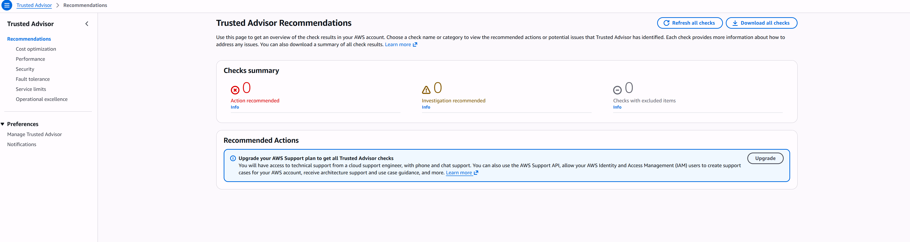
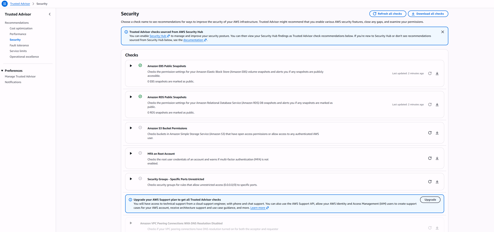
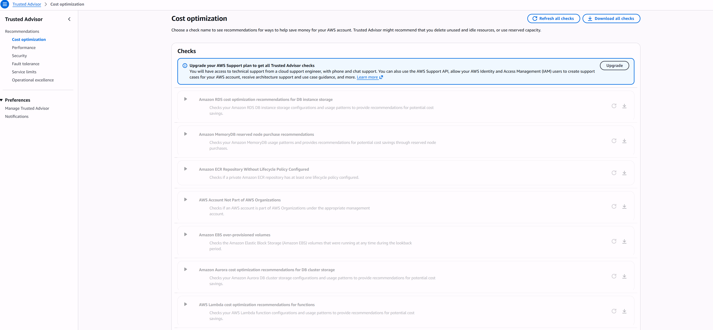
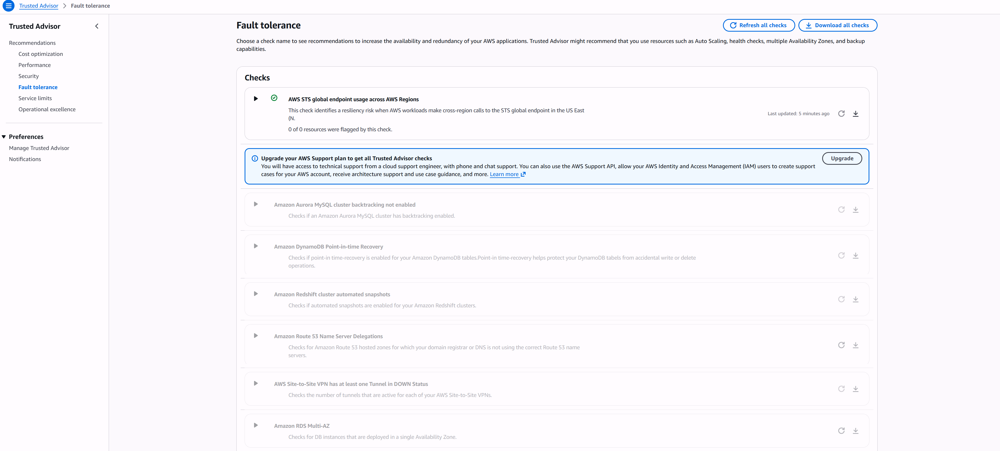
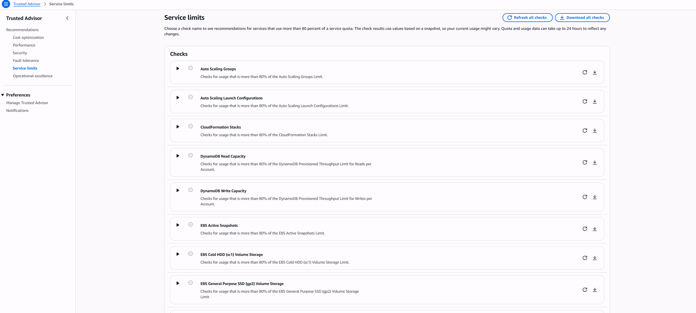
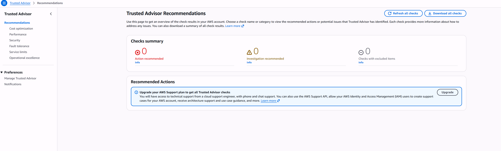
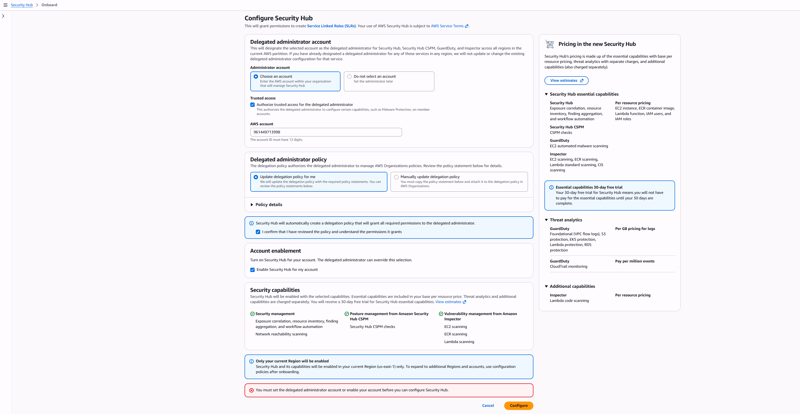
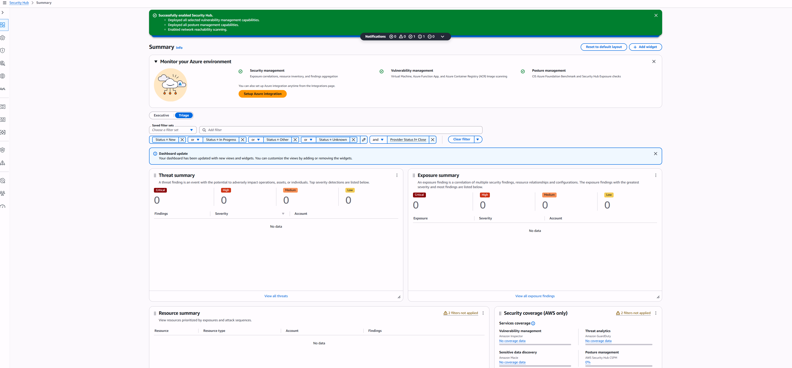
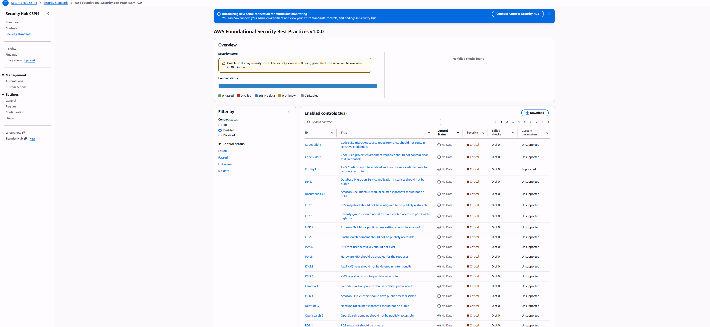
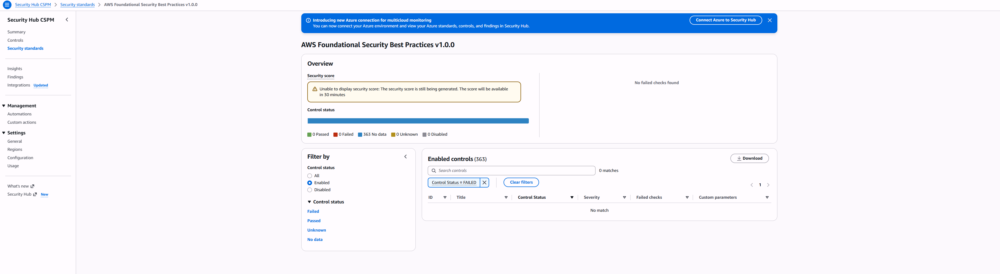
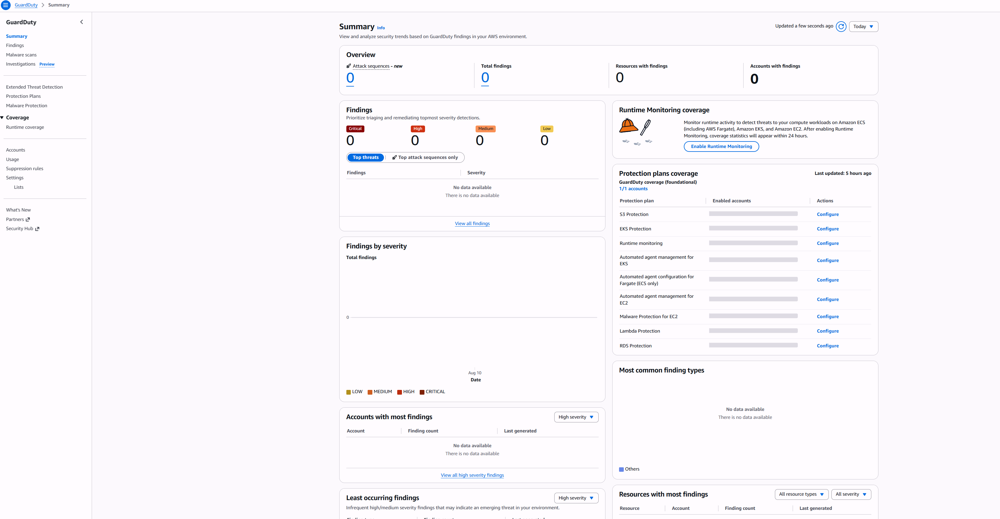
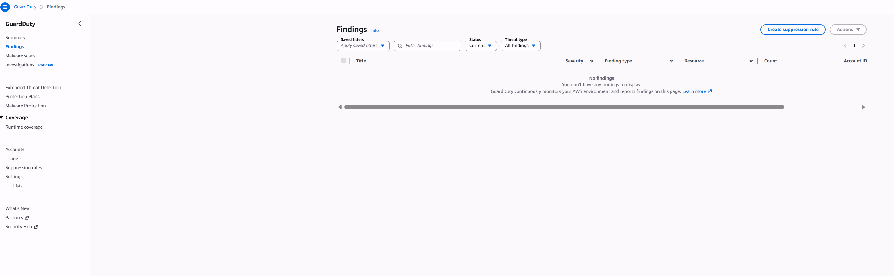
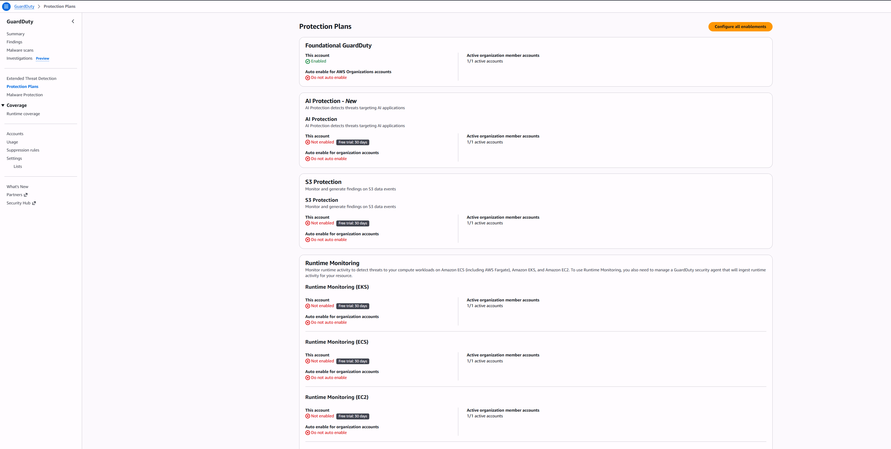
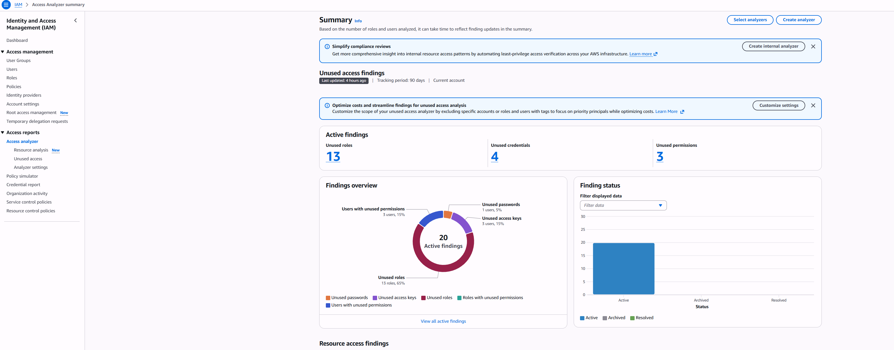
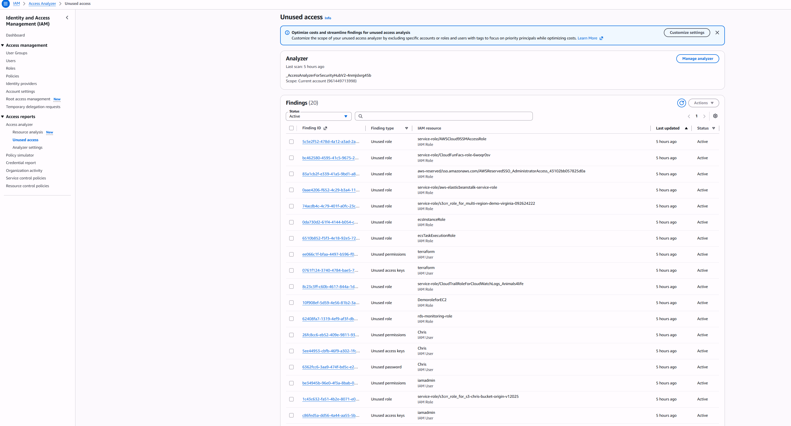
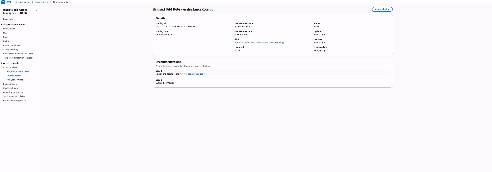

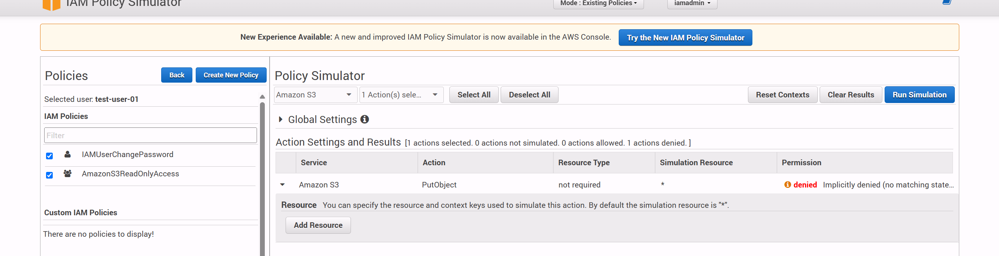

---
*Part of my AWS Cloud Engineering Portfolio | [View all projects](https://github.com/dcprice79)*
